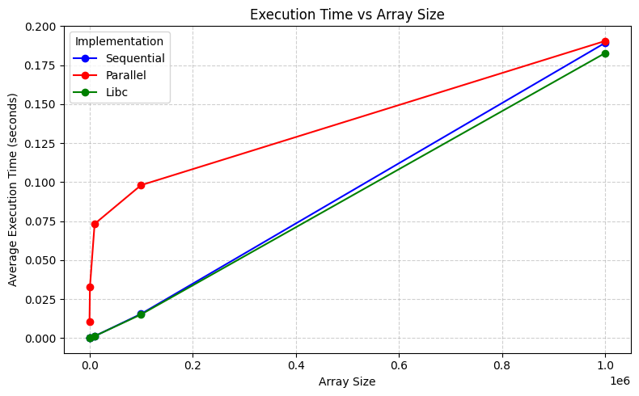

# Quicksort — Performance Evaluation

## Experiment

Firstly, I started by compiling and running the parallel and sequential implementations of QuickSort on my machine.  
The purpose of these experiments was to compare the execution times of three different sorting methods:

1. A custom sequential QuickSort  
2. A custom parallel QuickSort using multiple threads  
3. The built-in libc `qsort` function

I ran the programs for arrays of different sizes (100, 1,000, 10,000, 100,000, 1,000,000) and repeated each measurement five times to ensure consistency.  
The execution times were recorded in a text file for further analysis.

---

## Results

The table below shows the **average execution times** (in seconds) for each array size and sorting method:

| Size     | Sequential_avg (sec) | Parallel_avg (sec) | Libc_avg (sec) |
|----------|--------------------|------------------|----------------|
| 100      | 0.000007           | 0.010500         | 0.000008       |
| 1,000    | 0.000102           | 0.032990         | 0.000110       |
| 10,000   | 0.001245           | 0.073248         | 0.001239       |
| 100,000  | 0.015525           | 0.098076         | 0.015154       |
| 1,000,000| 0.189345           | 0.190551         | 0.182791       |

**Observations:**

- For very small arrays (100–10,000), the parallel version is slower than sequential due to thread management overhead.  
- For larger arrays (100,000+), the parallel implementation starts to approach the performance of sequential QuickSort.  
- Built-in `qsort` is consistently fast for all tested sizes.  

