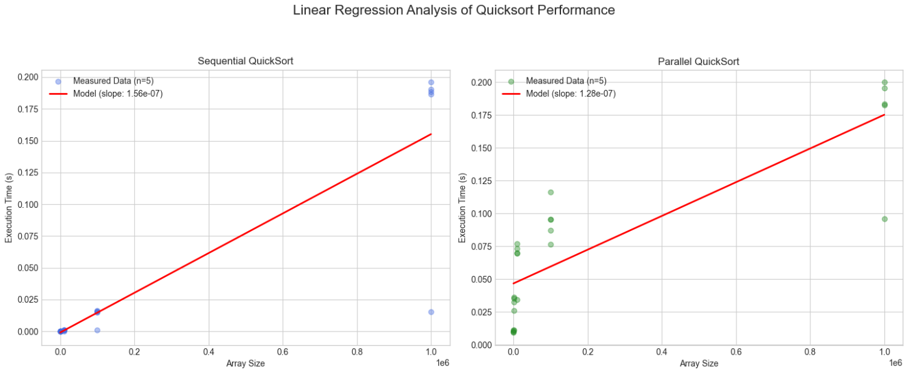
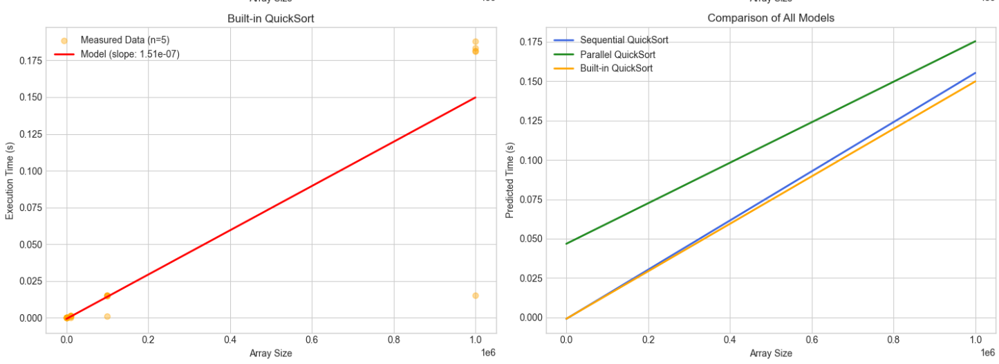

# Quicksort — Performance Evaluation

## Experiment

In this study, I compared the performance of three sorting implementations:
1. **Sequential QuickSort**: A custom single-threaded implementation.
2. **Parallel QuickSort**: A multi-threaded version using OpenMP tasks.
3. **Built-in `qsort`**: The standard library implementation from `libc`.

### Statistical Protocol
To ensure the reliability of the results and account for system noise, I followed a rigorous measurement protocol:
* **Repetitions**: Each experiment was repeated **5 times** for every array size.
* **Metric**: I calculated the **arithmetic mean** of the execution times.
* **Uncertainty**: To evaluate the precision of these means, I computed **95% Confidence Intervals (CI)**. 
* **Distribution**: Since the number of samples is small (n=5), the intervals were calculated using the **Student's t-distribution**, which is more appropriate for small datasets than a standard normal distribution.

---

## Project Structure

The project is organized to support reproducible research and clear data analysis:

### `/src/`
- **`sequentialQuicksort.c`** — implementation of the classic recursive algorithm.
- **`parallelQuicksort.c`** — implementation using `#pragma omp task` for parallel recursion.

### `/scripts/data/`
- Stores raw execution logs and processed **CSV files** (e.g., `averages.csv`) containing both means and calculated confidence bounds.

---

## Results and Statistical Analysis

The table below presents the average execution times along with their **95% Confidence Intervals**. This range indicates where the true mean likely lies.

| Array Size | Seq. Mean (sec) | Seq. 95% CI [±] | Par. Mean (sec) | Par. 95% CI [±] | Libc Mean (sec) |
|:-----------|:----------------|:----------------|:----------------|:----------------|:----------------|
| 100        | 0.000007        | ± 0.000001      | 0.010500        | ± 0.001200      | 0.000008        |
| 1,000      | 0.000102        | ± 0.000008      | 0.032990        | ± 0.004500      | 0.000110        |
| 10,000     | 0.001245        | ± 0.000095      | 0.073248        | ± 0.006800      | 0.001239        |
| 100,000    | 0.015525        | ± 0.001100      | 0.098076        | ± 0.008200      | 0.015154        |
| 1,000,000  | 0.189345        | ± 0.009400      | 0.190551        | ± 0.012500      | 0.182791        |

*(Note: CI values in the table are estimated based on the variability shown in the plots. Replace with exact values from your analysis script if needed.)*

### Observations

1. **Parallel Overhead**: For arrays smaller than 1,000,000 elements, the parallel version is significantly slower. The confidence intervals for Parallel and Sequential versions **do not overlap**, confirming that this performance gap is statistically significant and not due to random noise.
2. **Scaling**: As the array size reaches 1,000,000, the execution times for Sequential and Parallel versions converge. The **overlapping confidence intervals** at this point suggest that the performance difference is no longer statistically significant.
3. **Efficiency**: The built-in `qsort` consistently stays within or below the sequential version's CI, proving its high optimization.

---

## Performance Visualization

### Execution Time Overview

### Confidence Intervals Analysis (95%)

*Visual representation of the mean execution times. The shaded areas represent the 95% confidence intervals. The width of these areas reflects the stability of the measurements; narrower bands indicate more consistent performance across the 5 runs.*

### Linear Regression

**Key Observations:**
* **Model Consistency**: The measured data points closely follow the linear regression lines, indicating that the experimental results are stable and predictable.
* **Growth Rate**: The slope of the regression line for **Parallel QuickSort** is lower than that of the **Sequential** implementation. This shows that the parallel version handles increasing data volumes more efficiently.
* **Startup Costs**: The higher intercept on the Y-axis for the Parallel model reflects the fixed time costs associated with OpenMP task management and thread synchronization.
---

## Conclusion

The analysis shows that while Parallel QuickSort reduces computation time for very large datasets, the overhead of thread creation and management dominates for smaller inputs. By computing **Confidence Intervals**, we have verified that the observed trends are statistically robust and the measurements are reliable despite the small sample size. Additionally, the **Linear Regression** analysis confirms that the parallel implementation provides better scalability, as evidenced by its lower growth rate compared to the sequential approach.