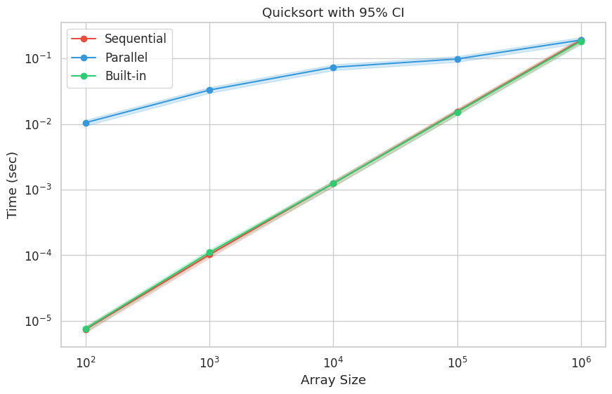

# Quicksort — Performance Evaluation

## Experiment

Firstly, I started by compiling and running the parallel and sequential implementations of QuickSort on my machine.  
The purpose of these experiments was to compare the execution times of three different sorting methods:

1. A custom sequential QuickSort  
2. A custom parallel QuickSort using multiple threads  
3. The built-in libc `qsort` function

I ran the programs for arrays of different sizes (100, 1,000, 10,000, 100,000, 1,000,000) and repeated each measurement five times to ensure consistency.  
The execution times were recorded in a text file for further analysis.

---
## Project Structure

The project is organized into several directories, each serving a specific purpose in the implementation, testing, and data analysis process.

---

### `/src/`

This folder contains the source code for all sorting implementations written in **C**.  
It includes:

- **`sequentialQuicksort.c`** — single-threaded QuickSort implementation  
- **`parallelQuicksort.c`** — multi-threaded QuickSort version using POSIX threads  

---

### `/test/`

This directory contains scripts used for running experiments and generating plots.  

### `/scripts/data/`

This folder stores all measurement data and generated results, including:

- **CSV files** containing average execution times (e.g., `averages.csv`)  

## Results

The table below shows the **average execution times** (in seconds) for each array size and sorting method:

| Size     | Sequential_avg (sec) | Parallel_avg (sec) | Libc_avg (sec) |
|----------|--------------------|------------------|----------------|
| 100      | 0.000007           | 0.010500         | 0.000008       |
| 1,000    | 0.000102           | 0.032990         | 0.000110       |
| 10,000   | 0.001245           | 0.073248         | 0.001239       |
| 100,000  | 0.015525           | 0.098076         | 0.015154       |
| 1,000,000| 0.189345           | 0.190551         | 0.182791       |

**Observations:**

- For very small arrays (100–10,000), the parallel version is slower than sequential due to thread management overhead.  
- For larger arrays (100,000+), the parallel implementation starts to approach the performance of sequential QuickSort.  
- Built-in `qsort` is consistently fast for all tested sizes.  

### **Confidence Intervals (95%)**

*Quicksort performance with 95% confidence intervals.  
The shaded regions represent the uncertainty of the mean execution time.  
Non-overlapping intervals indicate statistically significant performance differences.*

**Conclusion**

Parallel QuickSort shows no gain for small inputs due to threading overhead, but approaches sequential performance on large datasets. The built-in qsort remains the most efficient overall.