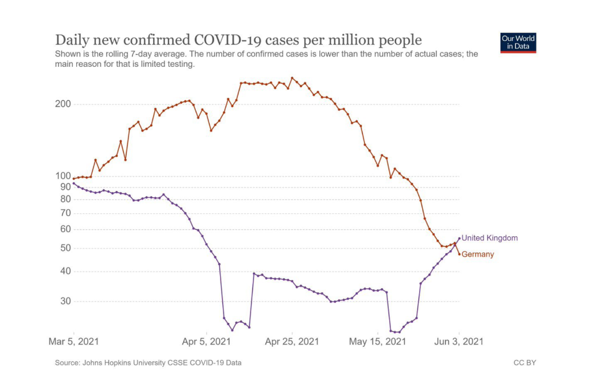

## Critique of "Daily new confirmed COVID-19 cases per million people" 

**Figure:** Rolling 7-day average of daily COVID-19 cases per million

**Objective:** Evaluate the chart using the checklist for good graphics and suggest improvements

---
### I. Analysis Based on the Checklist

The chart is a line plot which is appropriate for time-series data but it has several issues:

| Section | Checklist Item | Verdict | Comments |
| :--- | :--- | :--- | :--- |
| **Data** | Type of graphic fits the data| Pass | Line chart is suitable for time-series. |
| **Data** | Confidence intervals visualized | **Fail** | No error bars or indication of variability. This is important because the subtitle notes cases are limited by testing. |
| **Graphical objects** | Scales and units are explicit | **Fail** | The Y-axis is non-linear and unlabelled as such. The spacing between 30-50 and 90-200 is inconsistent, exaggerating differences in low-value regions. |
| **Annotations** | Axis labels clear and self-contained | **Fail** | Y-axis labels are misleading due to non-linear scaling. |
| **Annotations** | Origin at 0, or justified if not | **Fail** | Y-axis does not start at 0, which exaggerates differences in lower case numbers |
| **Information** | If showing averages, error bars included. | **Fail** | Rolling averages are shown, but no error bars provided. |
| **Overall** | Elegant and truthful representation | **Fail** | Non-linear unlabelled Y-axis distorts the data and misrepresents relative trends. |

**Additional Observations:**

- The UK line rises above 200 while Germany appears below 100, but the spacing exaggerates this gap.
- The 7-day rolling averge smooths the data, but variability is hidden.
- Colors alone distinguish the curves, which may be difficult for B/W printing.

---

### II. Proposed Improvements

To comply with the checklist, the improved chart should:

#### 1. Correct the Scale

- Y-axis should be **linear** and start at 0
- Tick marks: 0, 50, 100, 150, 200, 250
- This accurately represents differences and avoids exaggeration of small fluctuations

#### 2. Include Variability

- Add **semi-transparent error bands** (e.g., standard deviation or 95% confidence interval) around each line.
- Provides context for reliability and variability of the rolling average.

#### 3. Enhance Readability and Annotations

- Label the Y-axis explicitly as **"Linear scale"**
- Add legend for each line: UK (orange), Germany (dashed purple).
- Use different line styles for clarity in B/W printing
- Optional: add gridlines for better visual reference

---

### III. Suggested Chart Concept (Hand-drawn Description)

**Title:** Daily confirmed COVID-19 cases per million (7-day rolling average)

**X-axis:** Dates from Mar 5, 2021 to Jun 3, 2021

**Y-axis:** Linear, starting at 0, with ticks at 0, 50, 100, 150, 200, 250

**Lines:**

- UK: solid orange line
- Germany: dashed purple line

**Error bands:** Light gray semi-transparent around each line, showing variability of the 7-day rolling average

**Legend:** clearly indicates which line represents each country

**Notes:** This dsign preserves the original information, corrects scale distortion, shows data uncertainty, and improves readability for both color and B/W presentations.
