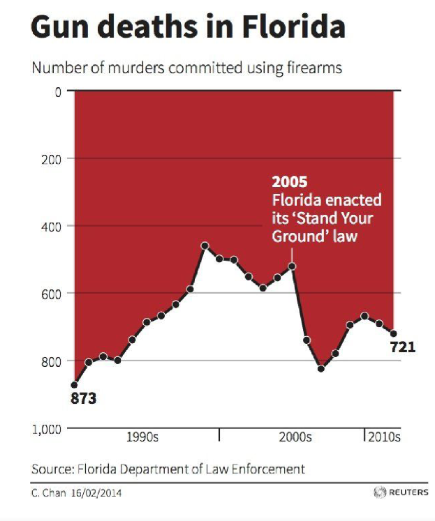

# Critical Review of the Graphic  
**“Gun deaths in Florida” (Reuters, source: Florida Department of Law Enforcement)**

### 1. Analysis Based on the Checklist

This graphic is visually striking and easy to read at first glance, but it violates several fundamental principles of good statistical graphics in ways that strongly bias interpretation.

* **Inverted Y-Axis (CRITICAL FAIL):**  
  - The vertical axis runs from **0 at the top** to **1000 at the bottom**.  
  - This directly violates the checklist rule that axes should go *from bottom to top*.  
  - As a result, **increases appear as downward movement**, which contradicts natural visual intuition.

* **Visual Distortion of Trends:**  
  - Because of the inverted axis, the sharp increase after the mid-2000s visually resembles a “collapse” rather than a rise.  
  - This inversion amplifies perceived changes and makes trend direction cognitively expensive to decode.

* **Emotional Background Coloring (FAIL):**  
  - The dominant dark red background carries a strong emotional connotation ( blood, alarm).  
  - According to the checklist, *no graphical object should be removable without loss of information*.  
  - The background can be removed without losing any data, meaning it functions as visual rhetoric rather than information.

* **Implicit Causality via Annotation (MAJOR ISSUE):**  
  - The annotation “2005 Florida enacted its ‘Stand Your Ground’ law” is prominently placed.  
  - While factually correct, its visual emphasis strongly suggests a **causal relationship** between the law and subsequent changes in gun deaths.
  - No statistical test, control group, or counterfactual is provided, violating principles of neutral data presentation.

* **Missing Normalization (FAIL):**  
  - The chart uses absolute counts instead of per-capita rates.  
  - Florida’s population grew significantly over the time period, making raw numbers misleading for long-term comparison.

* **No Uncertainty Representation (FAIL):**  
  - There are **no confidence intervals or error bars**, despite the data being derived from administrative and reporting systems that involve uncertainty.
  - This gives a false sense of precision to year-to-year fluctuations.

* **Overemphasis on a Single Curve:**  
  - Only one time series is shown, with no comparison to:
    - Other states  
    - National trends  
    - Non-firearm homicide trends  
  - The checklist encourages comparative context when interpreting curves.

---

### 2. Recommendations for Improvement

Several changes are necessary to align the chart with good visualization practices:

#### a) Fix the Y-Axis Orientation
* **Suggestion:** Use a standard vertical axis with **0 at the bottom**.
* **Reason:** This restores intuitive interpretation and prevents artificial exaggeration of trends.

#### b) Remove Rhetorical Background Color
* **Suggestion:** Replace the red background with a neutral white or light gray.
* **Reason:** This improves readability and removes emotional bias without information loss.

#### c) Normalize the Data
* **Suggestion:** Display firearm homicide rates per 100,000 inhabitants
* **Reason:** This allows meaningful temporal comparison despite population growth.

#### d) Clarify the Role of Policy Annotations
* **Suggestion:** Either:
  - De-emphasize the 2005 annotation visually, or  
  - Explicitly state that it is *contextual*, not causal.
* **Reason:** Prevents post hoc causal inference driven by visual proximity.

---

### 3. Suggested Chart Concept

**Title:** Firearm Homicide Rate in Florida (1980s–2010s)

**Y-axis:** Rate per 100,000 population, starting at 0.

**Layout:**  
- A single, clean line chart with a neutral background.  
- Optional comparison line (e.g., U.S. national average).

**Annotations:**  
- Minimal, neutral annotations for major legal or social events.  
- Clear disclaimer that correlation does not imply causation.

**Uncertainty:**  
- Semi-transparent confidence bands or an explicit methodological note.