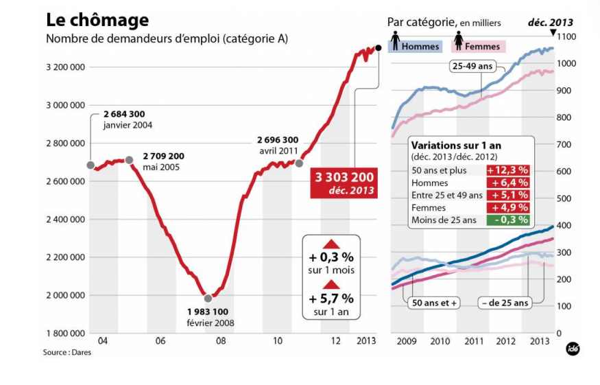

## 📉 Critique of "Le chômage" (Unemployment Chart)

**Figure:** Number of job seekers in France (Category A) from 2004 to 2013.

**Objective:** Evaluate if the graphic's high detail level provides clear information or creates visual bias according to the good graphics checklist.

### 1. Analysis Based on the Checklist

While this graphic is professionally produced and packed with data, it intentionally ignores several fundamental rules to emphasize a specific narrative.

* **The Truncated Y-Axis (CRITICAL FAIL):** The main vertical axis begins at **1,800,000** rather than zer
* **Lack of Justification:** According to the checklist, the origin should be (0,0) unless there is a clear justification, which is missing here
* **Visual Distortion:** By cutting off the bottom 1.8 million people, the chart **massively exaggerates** the visual "V" dip in 2008, making the drop look like a total collapse when it was actually a partial decrease.
* **Missing Confidence Intervals (FAIL):** As seen in previous examples, there are **no confidence intervals** or error bars visualized. 
* **Data Reliability:** Labor data is subject to statistical margins of error; omitting this leaves the precision of these specific points (like the 3,303,200 figure) in question.
* **Mixed Scales and Confusion (FAIL):** The graphic mixes millions on the left axis with thousands (0 to 1,100) on the right sub-charts
* **Inconsistent Comparison:** The checklist requires that curves be on the **same scale** for comparison. 
* **Cognitive Load:** Because the sub-charts start at 0 but the main chart does not, you cannot visually correlate the size of the "Men" or "Women" groups to the total population without doing manual math. 
* **Lack of Simplicity:** It risks failing the requirement that a graphic should be **elegant and simple**. 
* **Visual Clutter:** The sheer number of objects makes it hard for the reader to identify the most relevant information quickly, suggesting some objects could be removed without modifying readability.

---

### 2. Recommendations for Improvement

There are some changes needed:

#### a) Normalize the Y-Axis
* **Suggestion:** Start the main chart at **0**.
* **Reason:** This provides an honest view of the scale of unemployment relative to the whole population, preventing the visual "exaggeration" of the 2008-2013 climb.

#### b) Unified Scaling
* **Suggestion:** Place the category breakdowns (Men, Women, Age groups) on the same scale as the total.
* **Reason:** This allows the reader to see exactly how much each subgroup contributes to the total "Category A" number at a single glance.

#### c) Add Uncertainty Indicators
* **Suggestion:** Include error bands or shaded regions representing the statistical margin of error for these counts.
* **Reason:** This satisfies the requirement for visualizing variability when showing statistical totals or averages.

#### d) Simplify Annotations
* **Suggestion:** Remove redundant labels like the large red box for "dec. 2013" and instead rely on clear, standard axis labeling. 
* **Reason:** This follows the rule that no element should be removed without information loss

---

### 3. Suggested Chart Concept

**Title:** Trend of Category A Job Seekers in France (2004–2013)

**Y-axis:** Linear, starting at 0, reaching 4,000,000.

**Layout:** A single main plot with the total count as a bold line, and the categorical breakdowns (Men/Women) as thinner, stacked, or side-by-side lines on the same 0–4M scale.

**Annotations:** Semi-transparent error bands around the lines to show data precision, with only the most critical turning points (like the 2008 low) highlighted with small markers.